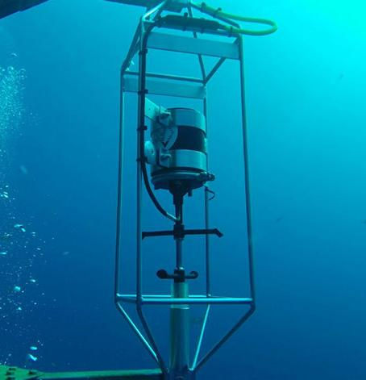

|    Metrics    |                                                                                     Master                                                                                     |                                                                                  Develop                                                                                 |
|:-------------:|:------------------------------------------------------------------------------------------------------------------------------------------------------------------------------:|:------------------------------------------------------------------------------------------------------------------------------------------------------------------------:|
| CI status     |  |  |
| Test coverage |  |  |

# Falmouth Scientific, Inc. ACM-Plus

* Read data from Falmouth Scientific, Inc. ACM-Plus
* Save data in database
* Publish data to MQTT broker